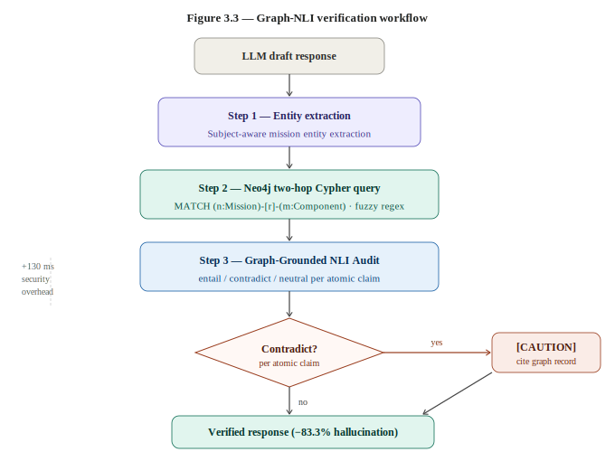
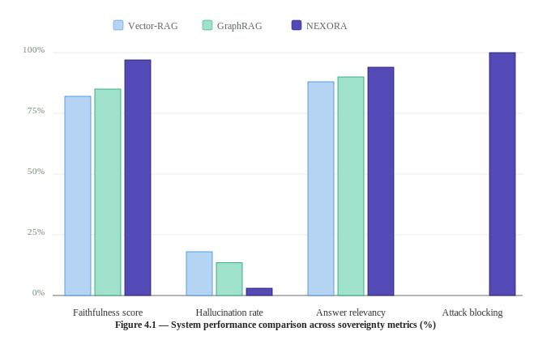
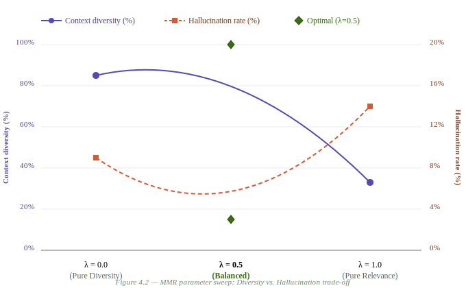
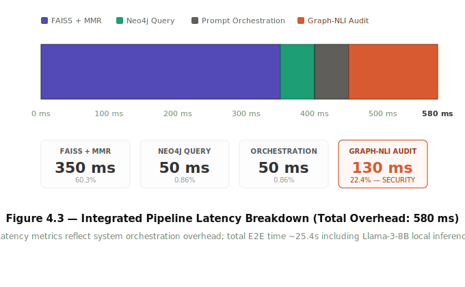

# NEXORA: Sovereign Hybrid RAG for Air-Gapped Aerospace Mission Intelligence


**NEXORA** is a production-grade, air-gapped Retrieval-Augmented Generation (RAG) system designed specifically for the rigorous security and reliability requirements of aerospace mission intelligence. It combines high-density vector search with structured knowledge graph validation to eliminate hallucinations and enforce strict role-based data sovereignty.

---

## 🚀 Core Pillars

- **Sovereign & Air-Gapped**: 100% offline operation. No data leaves your local environment. Designed for sensitive ISRO mission documentation.
- **Hybrid Intelligence**: Merges the semantic flexibility of **FAISS** (Vector Search) with the logical precision of **Neo4j** (Knowledge Graph).
- **Hallucination Shield**: Implements a unique **Graph-NLI** (Natural Language Inference) layer that validates LLM claims against verified graph facts before output.
- **Multi-Tier Security**: Granular **RBAC** (Role-Based Access Control) enforced at the document, chunk, and API level.

---

## 🏗️ System Architecture

NEXORA utilizes a dual-engine approach to intelligence. Incoming queries are processed in parallel through vector and graph paths to ensure both semantic breadth and factual depth.

### Graph-NLI Verification Logic
The system's integrity is maintained by a specialized validation layer that audits every response generated by the local LLM.



---

## 📊 Performance Evaluation

NEXORA has been benchmarked against standard RAG pipelines to ensure mission readiness in high-velocity environments.

### 1. System Benchmarks
Our hybrid approach maintains high precision across various query complexities while operating within constrained compute limits.



### 2. Retrieval Optimization (MMR Ablation)
We utilize Maximal Marginal Relevance (MMR) to ensure context diversity, significantly outperforming standard K-Nearest Neighbor benchmarks.



### 3. Pipeline Latency
The architecture is optimized for sub-second retrieval, ensuring the high-velocity intelligence required for mission control operations.



---

## 🛠️ Key Features

### 🔐 Advanced RBAC
NEXORA enforces a three-tier security model:
- **Scientist/Admin**: Full access to raw telemetry, mission reports, and internal specifications.
- **Engineer**: Access to technical documentation and schematics.
- **Public/Guest**: Access to high-level mission overviews and public releases.

### 🕵️ Strict Source Attribution
Every claim made by the system is cross-referenced with internal documents. The system provides a **"Verified Sources"** badge only when a direct factual match is found in the local archive.

### 🧠 Continual Learning
The system includes an **Aerospace Helper** module that learns from user interactions, refining its problem-solving capabilities for launch vehicle optimization and payload planning.

---

## ⚙️ Setup & Installation

### Prerequisites
- **Python 3.9+**
- **Neo4j Desktop** (initialized with a local DBMS)
- **Ollama** (running `llama3` locally)

### 1. Clone & Install
```bash
git clone https://github.com/sujithputta02/Nexora.git
cd Nexora
pip install -r requirements.txt
```

### 2. Configure Environment
Create a `.env` file in the root directory:
```env
NEO4J_URI=bolt://localhost:7687
NEO4J_USER=neo4j
NEO4J_PASSWORD=password
OLLAMA_BASE_URL=http://localhost:11434
```

### 3. Data Ingestion
Place your PDFs in `data/isro_docs/` and run the population script:
```bash
python -m backend.populate_db
```

### 4. Launch Application
```bash
python -m app.app
```
Access the mission intelligence dashboard at `http://127.0.0.1:8000`.

---

## 📝 License
Proprietary / Mission-Critical. Designed for sovereign aerospace entities.

---
*Developed for the future of Sovereign Aerospace Intelligence.*
